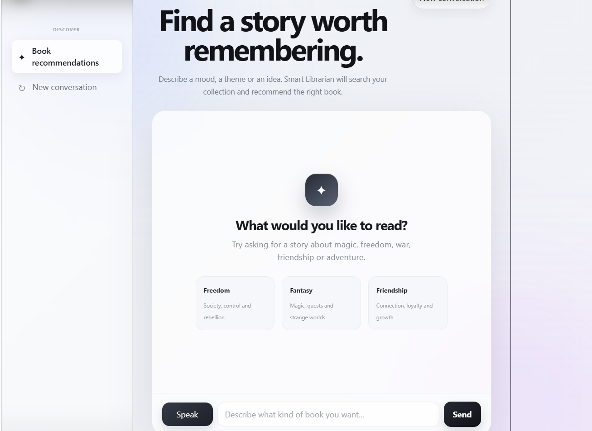
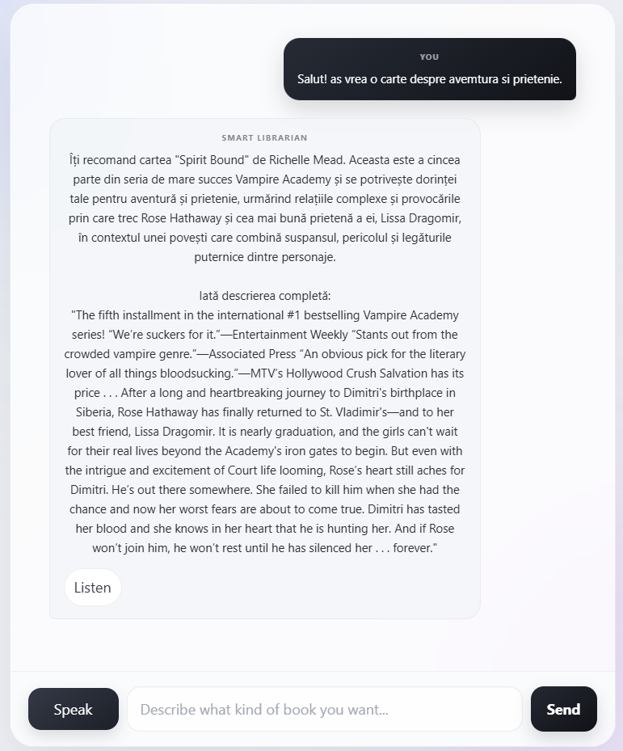

# Smart Librarian

Smart Librarian is an AI-powered book recommendation system that combines Retrieval-Augmented Generation (RAG), OpenAI GPT and ChromaDB to recommend books based on the user's interests.

The application retrieves the most relevant books from a local vector database, generates a conversational recommendation using OpenAI, and enriches the response through Function Calling by retrieving the complete summary of the selected book from a local data source.

In addition to text-based interaction, the application also supports Speech-to-Text, Text-to-Speech, conversation memory and a modern React interface.



---

## Features

- Semantic book search using ChromaDB and OpenAI embeddings
- AI-generated book recommendations using OpenAI GPT
- Retrieval-Augmented Generation (RAG)
- Function Calling for retrieving complete book summaries
- Conversation memory for follow-up questions
- Speech-to-Text support
- Text-to-Speech support
- Content moderation before AI processing
- FastAPI backend
- React frontend
- Responsive user interface

---

## Project Architecture

The application is divided into three main layers.

### Frontend

The user interface is built with React and communicates with the backend through REST endpoints exposed by FastAPI.

### Backend

The backend is responsible for:

- validating user requests;
- content moderation;
- semantic retrieval using ChromaDB;
- communicating with OpenAI;
- executing Function Calling tools;
- handling speech services.

### Data Layer

The data layer consists of:

- a local JSON library containing book information;
- a ChromaDB vector database containing semantic embeddings;
- OpenAI embeddings used for semantic search.

The overall flow of the application is shown below.

```text
User

↓

React Frontend

↓

FastAPI Backend

↓

Moderation

↓

Retriever (ChromaDB)

↓

OpenAI GPT

↓

Function Calling

↓

Local Book Summary Tool

↓

Final Response
```

---

## Project Structure

```text
FirstPythonProject/
│
├── backend/
│   └── FastAPI application
│
├── frontend/
│   └── React application
│
├── data/
│   └── Local book library
│
├── chroma_db/
│   └── ChromaDB persistent vector store
│
├── scripts/
│   └── Data preparation and vector store initialization
│
├── src/
│   ├── chatbot.py
│   ├── retriever.py
│   ├── tools.py
│   ├── data_loader.py
│   ├── moderation.py
│   ├── speech_to_text.py
│   ├── text_to_speech.py
│   └── openai_client.py
│
├── main.py
└── README.md
```

---

## Dataset Preparation

The project uses a Goodreads dataset downloaded from Kaggle as the initial source of books.

Since the dataset does not include suitable summaries for semantic retrieval, a separate data preparation step was implemented.

During this stage:

- book titles were cleaned by removing collection names enclosed in parentheses;
- author names were normalized by removing unnecessary whitespace;
- encoding issues were resolved;
- duplicate entries were removed.

After cleaning the dataset, every book was matched against the Google Books API.

The matching process compared multiple search results using both the title similarity and the author name to identify the best candidate.

Only books with a sufficiently accurate match were kept.

For every accepted book, the following information was stored locally:

```json
{
  "title": "...",
  "author": "...",
  "description": "..."
}
```

The final result is a local JSON library that serves as the knowledge base for the recommendation system.

---

## RAG Pipeline

The recommendation process is based on a Retrieval-Augmented Generation (RAG) architecture.

Instead of relying only on the language model, the application first retrieves the most relevant books from a local ChromaDB vector database.

Before the vector store is created, every book description is converted into an embedding using OpenAI's `text-embedding-3-small` model. The generated embeddings are then stored together with the corresponding metadata inside a ChromaDB collection.

When a user submits a request, the same embedding model is used to transform the query into a vector representation. ChromaDB performs a semantic similarity search and returns the most relevant books.

Only these retrieved books are provided to GPT as context, allowing the model to generate recommendations based exclusively on the available library rather than relying on its own knowledge.

The retrieval pipeline can be summarized as follows:

```text
books.json

↓

OpenAI Embeddings

↓

ChromaDB

↓

User Query

↓

Query Embedding

↓

Retriever

↓

Top Matching Books

↓

OpenAI GPT
```

---

## Function Calling

After selecting the most suitable recommendation, the language model retrieves the complete summary through OpenAI Function Calling.

Instead of generating the summary directly, GPT invokes the local `get_summary_by_title()` function.

The tool searches the local JSON library for the selected title and returns the complete description of the book.

The returned information is then provided back to the language model, allowing it to generate the final response while ensuring that the summary always originates from the local knowledge base.

```text
GPT

↓

get_summary_by_title()

↓

books.json

↓

Complete Summary

↓

Final Response
```



---

## Design Decisions

Several design choices were made during the implementation of the project.

- **JSON** was selected as the local knowledge base because the dataset is relatively small and does not require a relational database.
- **ChromaDB** was chosen as the vector database due to its simplicity, local persistence and straightforward integration with OpenAI embeddings.
- **FastAPI** exposes the backend functionality through REST endpoints while keeping the application lightweight.
- **React** provides a responsive and interactive user interface while remaining independent from the backend implementation.
- **Function Calling** was preferred over generating summaries directly in order to ensure that detailed book information always originates from the local dataset.
- **Google Books API** was used during the data preparation phase to enrich the Goodreads dataset with detailed book descriptions.

These decisions resulted in a modular architecture where each component has a single responsibility and can be replaced independently if needed.

---

## Voice Features

Besides traditional text interaction, the application also supports voice-based communication.

Speech-to-Text allows users to submit spoken requests using their microphone. The recorded audio is transcribed through OpenAI and automatically inserted into the chat input.

Text-to-Speech enables every recommendation to be converted into natural speech. Users can listen to the generated recommendation directly from the interface, while playback controls prevent multiple audio streams from playing simultaneously.

These features make the application more accessible and provide a more natural user experience.


---

## Backend API

The backend exposes a small REST API implemented with FastAPI.

| Endpoint | Description |
|----------|-------------|
| `GET /health` | Checks whether the backend is running |
| `POST /chat` | Generates a recommendation using the RAG pipeline |
| `POST /reset` | Starts a new conversation |
| `POST /speech-to-text` | Transcribes recorded audio into text |
| `POST /text-to-speech` | Converts a generated recommendation into speech |

The React frontend communicates exclusively through these endpoints, keeping the presentation layer separated from the application logic.

---

## Future Improvements

Possible future extensions of the project include:

- supporting larger book collections;
- allowing users to maintain personal reading preferences;
- storing conversation history in a database;
- generating book-related illustrations using image generation models;
- deploying the application to a cloud environment.

## Acknowledgements

This project was built using:

- OpenAI
- ChromaDB
- FastAPI
- React
- Vite
- Google Books API
- Goodreads Dataset (Kaggle)